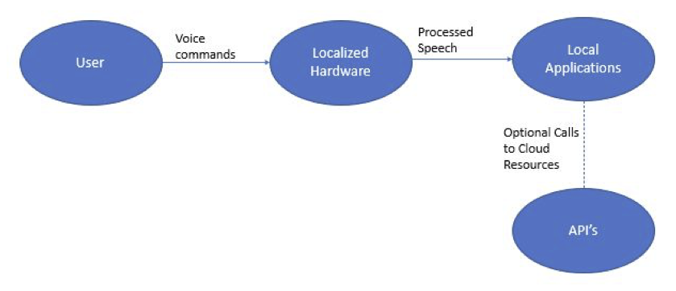
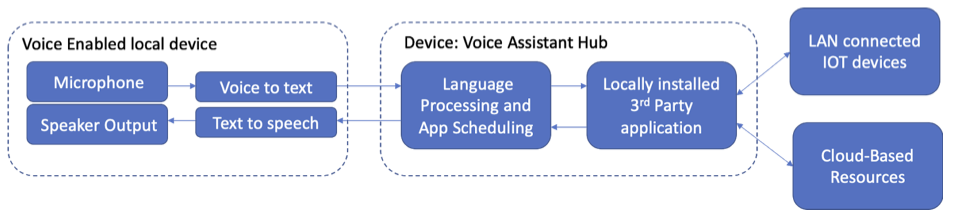
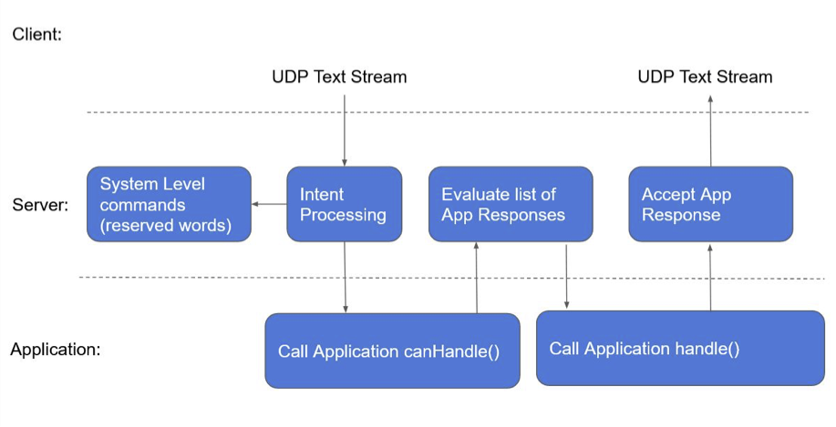

# User Stories and Design Diagrams

## User Stories

1. As a privacy-conscious user, I want a home voice assistant that keeps all of my voice data on the local network so that I have total control over my own voice data.
2. As a privacy-conscious user, I want the ability to specify what applications can and can’t do with my data
3. As a privacy-conscious user, I want the project code and ecosystem to be open source so that I can verify the trustworthiness and security of the voice assistant 
4. As a voice assistant user, I want the ability to add new functions to my voice assistant so that the software can continue to meet all of my needs
5. As a consumer, I want hardware that can support the basic functionalities of a voice assistant.

## Design Diagrams

Level 0

Level 1

Level 2

---

[⭠ Previous Page](03-user-stories-and-design-diagrams.md) | [Next Page ⭢](06-ppt-slideshow.md)
