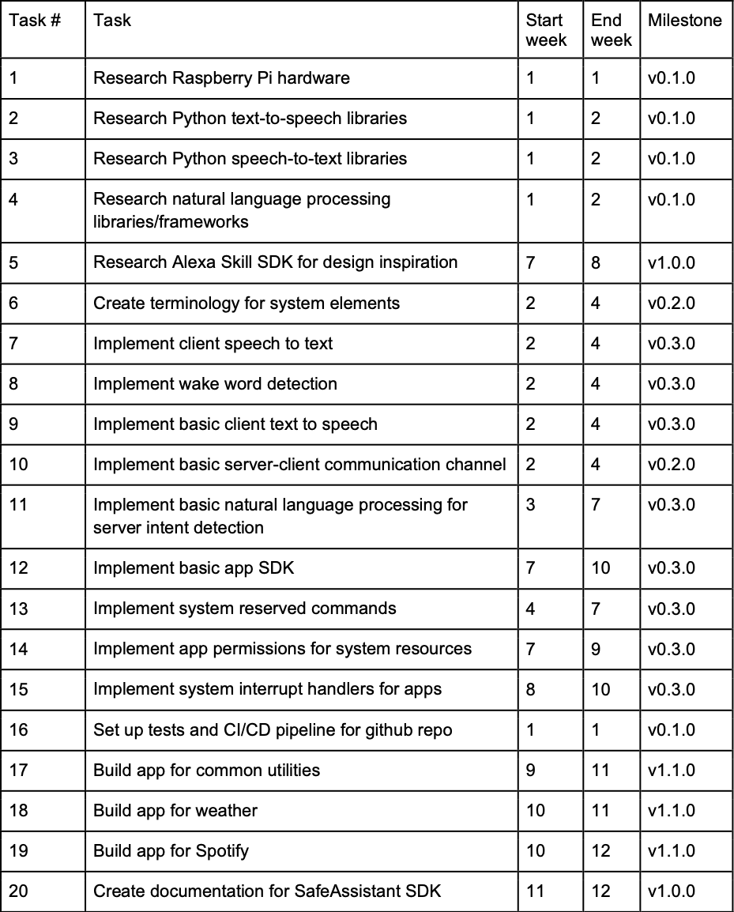
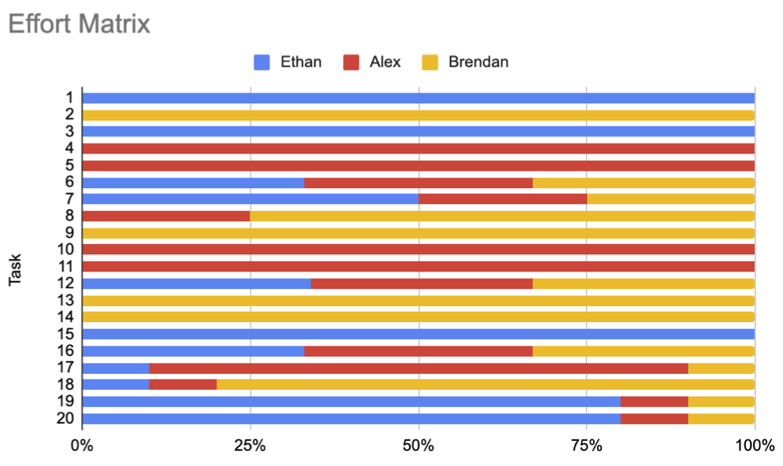

# Project Tasks and Timeline

## Tasklist

1. Research Raspberry Pi hardware (Ethan)
2. Research Python text-to-speech libraries (Brendan)
3. Research Python speech-to-text libraries (Ethan)
4. Research natural language processing libraries/frameworks (Alex)
5. Research Alexa Skill SDK for design inspiration (Alex)
6. Create terminology for system elements (Alex)
7. Implement client speech to text (Ethan)
8. Implement wake word detection (Brendan)
9. Implement basic client text to speech (Brendan)
10. Implement basic server-client communication channel (Alex)
11. Implement basic natural language processing for server intent detection (Alex)
12. Implement basic app SDK (team effort)
13. Implement system reserved commands (Brendan)
14. Implement app permissions for system resources (add to SDK) (Brendan)
15. Implement system interrupt handlers for apps (add to SDK) (Ethan)
16. Set up tests and CI/CD pipeline for github repo (team effort)
17. Build app for common utilities (alarms, timers, etc.) (Alex)
18. Build app for weather (Brendan)
19. Build app for Spotify (Ethan)
20. Create documentation for SafeAssistant SDK (Ethan)

## Timeline

## Effort Matrix

---

[⭠ Previous Page](03-user-stories-and-design-diagrams.md) | [Next Page ⭢](06-ppt-slideshow.md)
